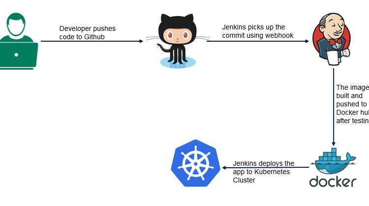

# MAAT-System

Project Overview:

Implemented a comprehensive DevOps solution involving continuous deployment, infrastructure management, and automated workflows using Kubernetes and Jenkins.
   
</div>

## Key Responsibilities:

 __Infrastructure Provisioning__

- Defined and provisioned Azure Kubernetes Service (AKS) resources using Terraform to ensure scalable and consistent infrastructure.


__Containerization:__

- Developed Dockerfiles for Django backend and Flask frontend applications to containerize the code for better portability and scalability.
- Created a Dockerfile for NGINX to serve as a reverse proxy and handle static files for the Django application.


 __CI/CD Pipeline:__

- Configured Jenkins to manage continuous integration and continuous deployment, automating the build and deployment processes.
- Integrated Jenkins with GitHub to trigger automated builds and deployments upon code commits.
- Set up Jenkins pipelines to automate Docker image builds, push them to Docker Hub, and deploy applications to AKS.


__Kubernetes Deployments:__

- Wrote Kubernetes deployment and service YAML files for the Django and Flask applications, enabling seamless deployments.
- Configured persistent volumes and claims to manage static files and ensure data persistence.
- deployed NGINX as a reverse proxy to efficiently handle client requests and serve static content.

  
__Secrets and Configuration Management:__

- Utilized Kubernetes Secrets to securely manage sensitive information and environment variables.
- Configured environment variables to manage application settings dynamically across different environments.


### Technologies Used:

Tools: Terraform, Jenkins, Docker, Kubernetes, NGINX
Languages: Python, JavaScript
Cloud Platform: Azure
CI/CD: Jenkins Pipelines, GitHub Integration
## install and setup
1. Clone the repository

   ```bash
   git clone https://github.com/ak4m410x01/Examination_Platform_API.git .
   ```

2. run Terraform files
      ```bash
      
     ```
3. run Kubernetes deployments files
   ```bash
      kubectl apply -f django/
      kubectl apply -f nginx/
      kubectl apply -f flask-deployment.yml
   ```
4. show the aks resources
   ```bash
      kubectl get all
   ```


